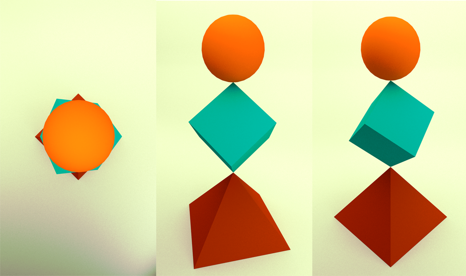

# Blender course for Modeling initiation on IME

This is a list of topics discussed during the Blender classes for 3D modeling initiation on IME (Institute of Mathematics and Statistics) at USP (University of São Paulo).

This content is **NOT** a tutorial.

## References
* [Blender Reference Manual](https://www.blender.org/manual/contents.html)
* [Quick tip on Blender UI editors](http://www.blendernation.com/2016/10/20/quick-tip-blender-ui-editors/)
* [Blender addon programming tutorial](http://www.blendernation.com/2016/10/18/blender-addon-programming-tutorial/)

## Content

* [Mac users](#mac);
* [Basic](#basic):
    * [Interface & Navigation: 3D View mode](#interface);
    * [Manipulation: Edit mode](#editmode);
    * [Task](#taskbasic).

## Mac users

Mouse functions for Macbook users ([source](https://www.blender.org/forum/viewtopic.php?t=761)):

*	With the left mouse button you can activate on screen menus and buttons, resize sub-windows and set the 3D view cursor. In the Mac version this is the default behaviour when you press the mouse button. 
*	With the middle mouse button you can move, rotate and zoom the 3D view or other views. Keep the Alt key pressed in combination with the Shift and Ctrl keys to get this behaviour when you press the mouse button. 
*	With the right mouse button you can select 3D objects. Keep the Apple (aka Command) key on your keyboard pressed when pressing the mouse button. 

[> back to content](#content)

## Basic

### Cycles render

What is it?

        Cycles is Blender’s ray-tracing production render engine.

Why use it?

        GPU Rendering is not available for Blender Internal

[> back to content](#content)

### Interface & Navigation: 3D View mode

1. Rotate/move through the scene;
2. Centering view on object; 
1. Activate `Quad View`: 4 view ports
3. Select/deselect objects
4. Rotate/move objects: manual or specify coordinates
1. Multiply/delete objects
1. Layer navigation
1. Add basic mesh objects: cube, UV sphere, cylinders etc
1. Modify vertices numbers
1. Smooth meshes

[> back to content](#content)

### Manipulation: Edit mode

1. Present: Vertices, edges and faces
2. Hotkeys: Fast selection with `Ctrl + Tab`
3. Select/deselect
4. Rotate/move
5. Create new vertices, edges and faces
6. Delete
7. Add new object on `Edit mode`: means one whole object

[> back to content](#content)

### Task

Reproducing the following scene:

* top: UV Sphere
* middle: Cube
* bottom: Cone with 4 vertices

Hint on how to snap cube to cone:

1. select desired vertice from cube;
2. `Shift + S` to choose `Cursor to Selected`
3. At `3D View Mode`, `Ctrl + Alt + Shift + C` to `Set origin > Origin to 3D Cursor`
4. Use `Snap` mode to place cube vertice to the cone vertice

[> back to content](#content)
